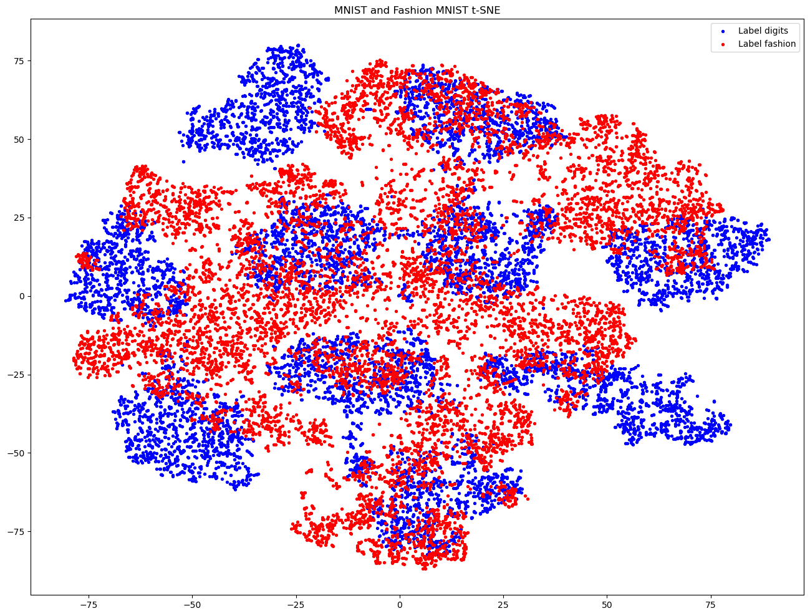

# Neural-Network-Playground

# Question 1
This is a Streamlit app that allows users to interactively explore and visualize the decision boundaries learned by a neural network on different types of datasets. The app provides various features and functionalities, making it easy for users to experiment with different dataset types, basis functions, and neural network architectures. It is deployed at https://neural-network-playground-arf8r3sule3ohwtbiydgxe.streamlit.app/

## Features

1. **Dataset Selection:**
   - Users can choose from three different types of datasets: 'circle', 'spiral', and 'exclusive_or'.
   - 'circle': Generates a circular dataset with points inside and outside the unit circle.
   - 'spiral': Generates two spirals, allowing the neural network to learn a more complex decision boundary.
   - 'exclusive_or': Generates a dataset with points in the four quadrants, and the neural network learns the XOR operation on the input features.

3. **Basis Functions:**
   - Users can optionally include basis functions to transform the input features of the dataset.
   - Available basis functions include 'X1', 'X2', 'X1^2', 'X2^2', 'X1X2', 'sin(X1)', 'sin(X2)', 'gaussian X1', and 'gaussian X2'.
   - The app will stop when the user doesn't select any of the basis functions. At least one needs to be selected.

4. **Neural Network Architecture:**
   - Users can specify the number of hidden layers and the number of neurons in each hidden layer.

5. **Training and Visualization:**
   - The app trains the neural network on the generated dataset using the specified architecture and hyperparameters.
   - It visualizes the decision boundaries learned by the neural network using contour plots.
   - The contour plots show the probabilities of the positive class (label=1) across the input feature space, helping users understand how the neural network classifies different regions.

6. **Monte Carlo Dropout (MC Dropout):**
   - Users can apply Monte Carlo Dropout to capture model uncertainty.
   - The app visualizes decision boundaries and uncertainties using additional contour plots with MC Dropout.

# Question 2
For the task, I have created a CNN having two convolution and two pooling layers. This is follwed by a MLP. At the end there is a softmax to get the probabilites of the 10 classes.

For hyperparameters tuning I have iterated over, learning rates, steps_per_epcohs, epochs.

For the MNIST Dataset:
Accuracy without MC dropout: 98.879999%
Accuracy with MC dropout: 98.910000%

There is a very slight improvement in the accuracy with MC dropout. This is because the model is not very complex and the dataset is also not very complex. So, the model is able to learn the data very well. Droputs in the training phase are able to regularize the model well enough.

## Part a.

We removed the last layer(softmax) from the trained model. Our last layer of the model is having 64 neurons. Therefore the output for the model for any image from the MNIST dataset would be a vector of size 64. We ran the model on 10000 (test MNIST split) and ploted the output in 2D using t-SNE. The plot is shown below:

As you can see that the digits have clustered well and our model is performing nicely. The digits are well separated and there is no overlap between the clusters. This shows that the model is able to learn the data well and is able to classify the digits well.

## Part b.
For the following part, we have measured uncertainity as 1- probability of the predicted class. (We have taken the maximum probability as the predicted class). This is similar to least confident. We have calucualted uncertainity for each of the test point and then plotted a histogram to see in which range most of the uncertainity lies. 

### Fashion MNIST
We took 100 images from the  MNIST Fashion Dataset and ran the model on them. We saw that without MC dropout, there was very low uncertainity in prediction in majority of the points. Therefore our model was classifying multiple fashion images as digits with high confidence.
##### Without MC Dropout

##### With MC Dropout

With MC Dropout we saw that the peak of the graph shifted to the middle. Hence it was more uncertain and less confident while classifying fashion images as digits. This is actually desirable as we want our model to be uncertain about the data it was not trained on.

### Digit MNIST
We took 100 images from the  MNIST Digit Dataset and ran the model on them. In case of digits, we saw that the model was able to classify the digits with high confidence and very low uncertainity in both the cases, i.e. with and without MC dropout.
##### Without MC Dropout

##### With MC Dropout

In both the cases the digits are predicted with very low uncertainity and very high confidence.

## Part c.
As we have removed the last layer, the output of the model is a vector of size 64. We have taken 10000 test images from MNIST dataset and 10000 test images from the Fashion MNIST dataset. We have plotted the output of the model in 2D using t-SNE. The plots are shown below:

##### Without MC Dropout

In the above graph we can see that there is a larger overlap between the red and the blue points. The red points (fashion images) will be classified as digits with the same probabilites as the neighbouring blue points(digit images). This is not desirable as we don't want our model to classify fashion images as digits with high confidence. We want our model to show high variance/uncertainity on the points on which it is not trained.

##### With MC Dropout

In the above graph we can see that there is less overlap between the red and the blue points. Therefore the inputs to the softmax layer would be different and they will be classified with different probabilites. Our model is showing higher variance on the data on which is it not trained, which is what is desired.

